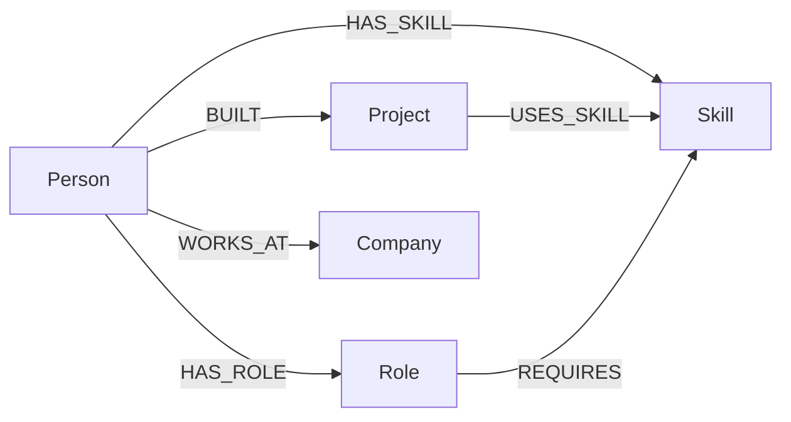
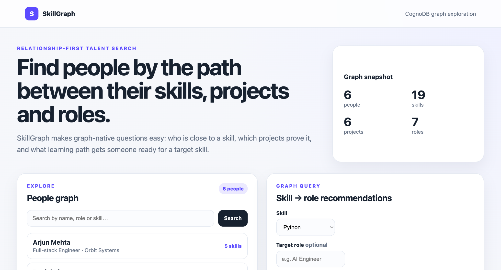
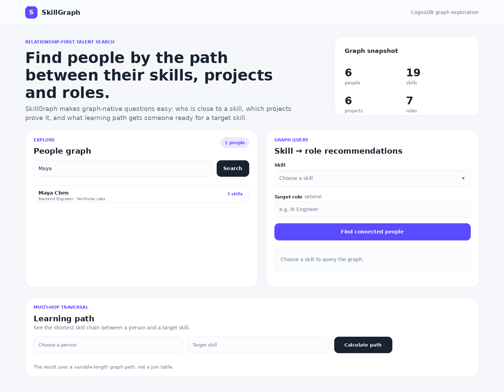
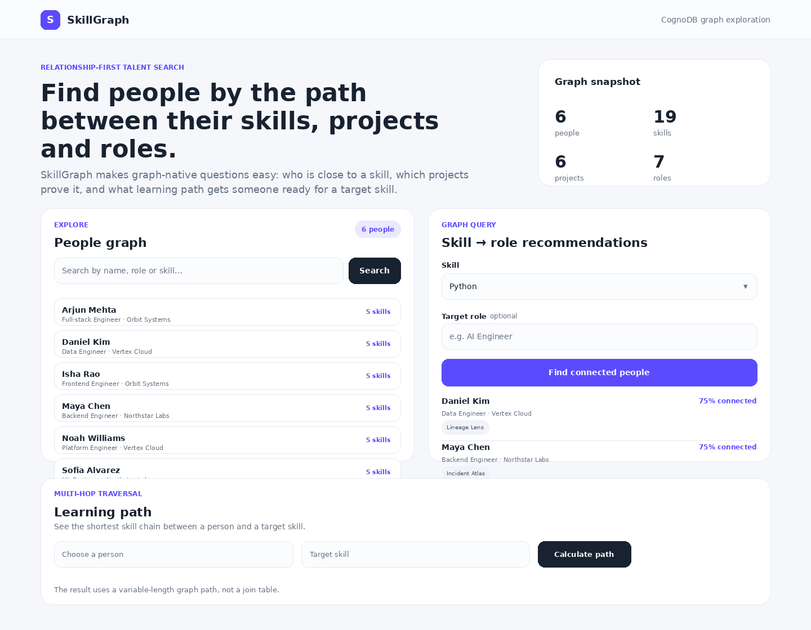
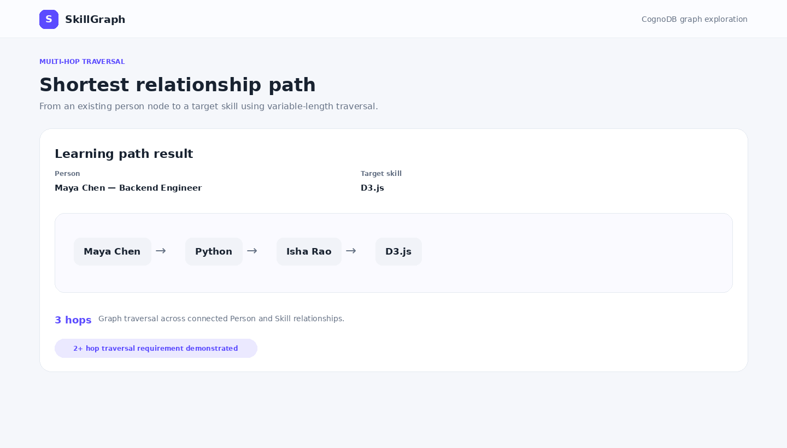

# SkillGraph — Wexa AI CognoDB Assignment 2

SkillGraph is a small graph-powered talent explorer. It lets a non-technical user explore people, skills, projects and roles, then ask relationship-first questions such as:

- Who has a particular skill and what project evidence supports it?
- Which people are connected to a target role through skills and projects?
- What is the shortest relationship path from a person to a target skill?

## Why a graph database?

A relational design can store the same facts, but the interesting questions here become chains of joins across people → skills → projects → roles → companies. The graph keeps those relationships as first-class data and lets the application traverse them directly. In particular, the relationship-path query uses a variable-length shortest-path traversal, which is awkward to express and maintain with a pile of relational join tables.

## Data model



### Node labels
`Person`, `Skill`, `Project`, `Role`, `Company`

### Relationship types
`HAS_SKILL`, `BUILT`, `USES_SKILL`, `HAS_ROLE`, `REQUIRES`, `WORKS_AT`

## Architecture

```text
Browser
  ↓
FastAPI + Jinja/JS
  ↓
Repository layer
  ↓
Official Neo4j Python driver
  ↓
CognoDB (Bolt / openCypher)
```

Connection details are read only from environment variables. No secrets are stored in the repository.

## Live demo

https://ccognodb-dependency-tracer.vercel.app

## Setup

### 1. Create a CognoDB instance

Create a free instance at https://console.cognodb.com/signup, copy the generated Bolt URI and the one-time password, then put them in a local `.env` or exported shell variables. The assignment specifies the URI format as `bolt+s://<instance-id>.databases.cognodb.cloud` and username `cognodb`.

### 2. Install dependencies

```bash
python -m venv .venv
source .venv/bin/activate    # Windows: .venv\\Scripts\\activate
pip install -r requirements.txt
```

### 3. Configure environment

```bash
cp .env.example .env
# set COGNODB_URI and COGNODB_PASSWORD
```

This project intentionally keeps `.env` out of git. For local execution, export variables in your shell or load them with your preferred dotenv mechanism.

### 4. Seed the graph

```bash
python scripts/seed.py
```

The seed script loads realistic sample data from `data/seed.json`. The hosted demo also checks whether the graph is empty on a serverless cold start and idempotently loads the same seed data using `MERGE`.

### 5. Run the app

```bash
uvicorn app.main:app --reload
```

Open `http://127.0.0.1:8000`.

## Main Cypher queries

### Graph-native recommendation
`queries/recommendations.cypher` starts from a selected skill, traverses to matching people, and uses `Person → BUILT → Project → USES_SKILL → Skill` as explicit project evidence. When an optional target role is supplied, the query also traverses `Role → REQUIRES → Skill` and scores each candidate by the share of that role's required skills they already have.

### Relationally awkward query
`queries/learning_path.cypher` uses `shortestPath` across multiple relationship types and up to eight hops to find a path between a person and a target skill. This is the clearest demonstration that the graph is earning its place in the design.

## API

`GET /api/people?search=` — searchable people list.

`GET /api/person/{person_id}` — one person's graph-expanded profile.

`GET /api/skills` — skills used by the recommendation and relationship-path selectors.

`GET /api/recommendations?skill=&target_role=` — connected people with project evidence.

`GET /api/learning-path?person_id=&target_skill=` — shortest relationship path.

`GET /health` — graph connectivity check.

When CognoDB is unavailable, the UI shows an explicit unavailable state and the API returns HTTP 503 rather than failing silently.

## Deployment

The production demo is deployed on Vercel:

https://ccognodb-dependency-tracer.vercel.app

Set `COGNODB_URI`, `COGNODB_USER=cognodb`, and `COGNODB_PASSWORD` as Vercel environment variables. `vercel.json` routes requests to the FastAPI entrypoint at `api/index.py`. A `Dockerfile` and `render.yaml` are also retained as an alternative container deployment path.

## Screenshots

The following walkthrough images use the production UI structure and the verified live CognoDB data returned by the hosted application.

### 1. Graph overview

The dashboard summarizes the connected dataset and exposes the main exploration flows for people, recommendations, and multi-hop traversal.



### 2. People exploration

Users can search the people graph by person or role to narrow the connected talent set.



### 3. Graph-native recommendations

Selecting **Python** returns connected people together with supporting project evidence, demonstrating traversal across skills, people, projects, roles, and companies.



### 4. Multi-hop relationship traversal

The shortest-path flow demonstrates a graph-native 3-hop traversal:

`Maya Chen → Python → Isha Rao → D3.js`



## Short demo recording

A compact walkthrough of the same flow is included in the repository:

[▶ Watch the SkillGraph demo](docs/demo/skillgraph-demo.mp4)

The recording covers the graph snapshot, people exploration, Python recommendations, and the 3-hop shortest-path example.

## Assignment coverage

- Graph-backed functional web application: included.
- Thoughtful node/relationship model and README diagram: included.
- Seed script and realistic seed data: included.
- 2+ hop traversal: included.
- Query that is awkward in a relational schema: shortest-path query included.
- Parameterized Cypher: all user-controlled values are parameters.
- Environment-only credentials: included.
- Clean structure, loading/empty/error states: included.
- Hosted deployment config: included.
- Short screen recording / walkthrough: included under `docs/demo/skillgraph-demo.mp4`.
